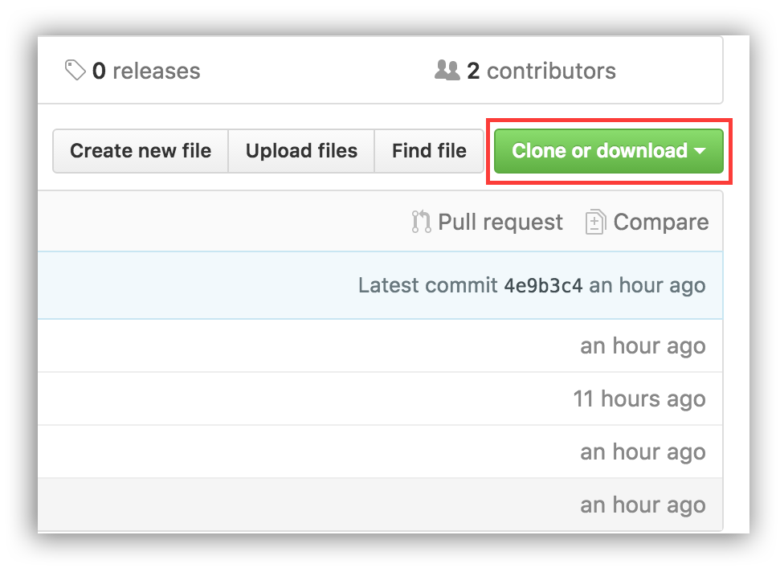
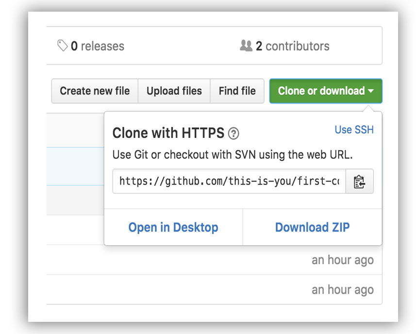

](https://github.com/ellerbrock/open-source-badges/)

## Details

Hi there, if you are reading this then probably you are new to open source and looking for some issues to contribute to.  
You can start by contributing to this awesome list, follow these simple steps to make your first successful PR.  

## Steps:

1. Installation of required tools:
* git
* any IDE of your choice (for ex. sublime text and atom)

### Installing git:

- Ubuntu:  `sudo apt-get install git`
- Windows: [Download](https://git-scm.com/download/win)
- Mac: [Download](https://git-scm.com/download/mac)


# First Contributions

It's hard. It's always hard the first time you do something. Especially when you are collaborating, making mistakes isn't a comfortable thing. We wanted to simplify the way new open-source contributors learn & contribute for the first time.

Reading articles & watching tutorials can help, but what's better than actually doing the stuff in a practice environment? This project aims at providing guidance & simplifying the way beginners make their first contribution. If you are looking to make your first contribution, follow the steps below.


If you don't have git on your machine, [install it]( https://help.github.com/articles/set-up-git/).

## Fork this repository

Fork this repo by clicking on the fork button on the top of this page.
This will create a copy of this repository in your account.

## Clone the repository



Now clone the forked repo to your machine. Go to your GitHub account, open the forked repo, click on the clone button and then click the *copy to clipboard* icon.

Open a terminal and run the following git command:

```
git clone "url you just copied"
```
where "url you just copied" (without the quote marks) is the url to this repository (your fork of this project). See the previous steps to obtain the url.



For example:
```
git clone https://github.com/this-is-you/first-contributions.git
```
where `this-is-you` is your GitHub username. Here you're copying the contents of the first-contributions repository in GitHub to your computer.

## Create a branch

Change to the repository directory on your computer (if you are not already there):

```
cd first-contributions
```
Now create a branch using the `git checkout` command:
```
git checkout -b <add-your-new-branch-name>
```

For example:
```
git checkout -b add-alonzo-church
```
(The name of the branch does not need to have the word *add* in it, but it's a reasonable thing to include because the purpose of this branch is to add your name to a list.)


## Push changes to GitHub

Push your changes using the command `git push`:
```
git push origin <add-your-branch-name>
```
replacing `<add-your-branch-name>` with the name of the branch you created earlier.

## Submit your changes for review

If you go to your repository on GitHub, you'll see a  `Compare & pull request` button. Click on that button.


Now submit the pull request.


Soon I'll be merging all your changes into the master branch of this project. You will get a notification email once the changes have been merged.

## Where to go from here?

Congrats!  You just completed the standard _fork -> clone -> edit -> PR_ workflow that you'll encounter often as a contributor!


You could join our slack team in case you need any help or have any questions. [Checkout our slack page](https://iiitkalyanifosc.slack.com/messages/CA03WCVQE/).

Now let's get you started with contributing to other projects. We've compiled a list of projects with easy issues you can get started on.
